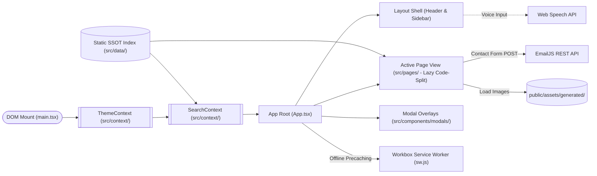
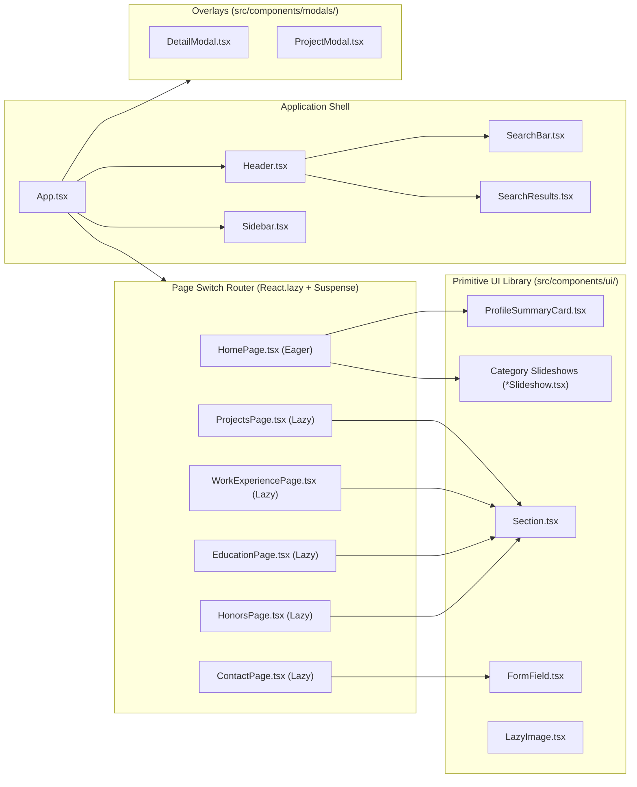
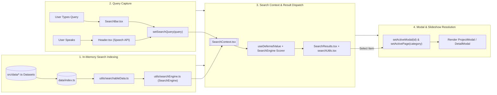
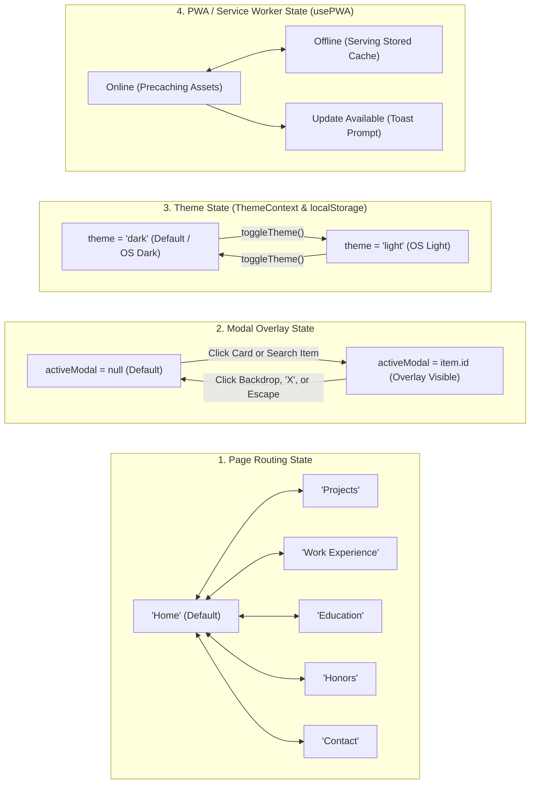
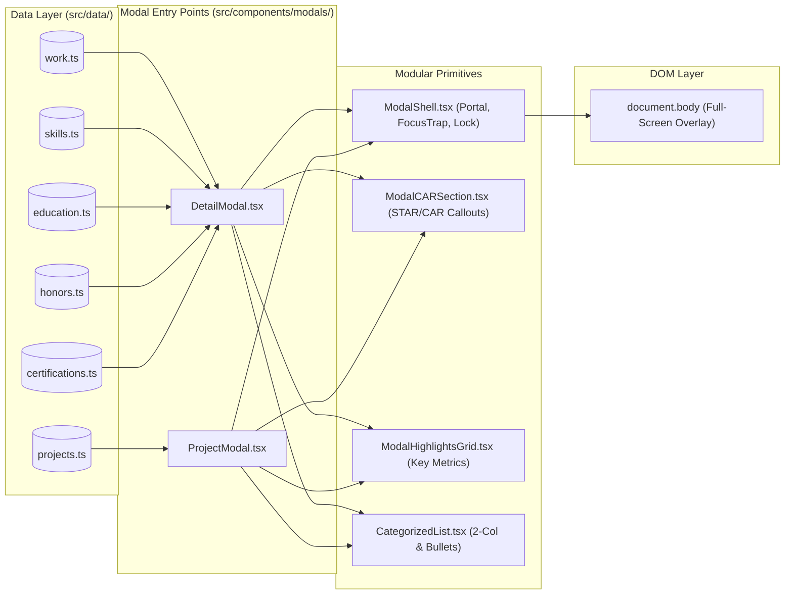

# System Architecture & Technical Topology (architecture.md)

This document maps the architectural structure, component trees, and runtime data flows for Hanson-Tube.

---

## 1. System Topology & Infrastructure

Hanson-Tube runs as a client-side Single Page Application (SPA) hosted on GitHub Pages CDN with zero server-side infrastructure. Built on **React 19**, **TypeScript 5.8+**, **Vite 7**, and **Tailwind CSS 4**, all domain data is strongly-typed and bundled into static modules with route code-splitting and Workbox PWA service-worker caching.

### Layer Summary

| Layer                   | Responsibility                                                 | Key Files                                                                                                                                                                                                                                                                                                                              |
| :---------------------- | :------------------------------------------------------------- | :------------------------------------------------------------------------------------------------------------------------------------------------------------------------------------------------------------------------------------------------------------------------------------------------------------------------------------- |
| **DOM Entry**           | Injects React 19 tree into `#root` and loads global styles.    | [`main.tsx`](file:///C:/Users/kobby/Downloads/gitProjects/kxnghans.github.io/src/main.tsx), [`index.css`](file:///C:/Users/kobby/Downloads/gitProjects/kxnghans.github.io/src/index.css)                                                                                                                                             |
| **Theme Context**       | Manages light/dark mode, localStorage sync, and system theme.  | [`ThemeContext.tsx`](file:///C:/Users/kobby/Downloads/gitProjects/kxnghans.github.io/src/context/ThemeContext.tsx)                                                                                                                                                                                                                     |
| **Search Context**      | Orchestrates search queries, voice state, and open modals.     | [`SearchContext.tsx`](file:///C:/Users/kobby/Downloads/gitProjects/kxnghans.github.io/src/context/SearchContext.tsx)                                                                                                                                                                                                                   |
| **App Shell**           | Manages `activePage`, PWA lifecycle, hotkeys, and layout.      | [`App.tsx`](file:///C:/Users/kobby/Downloads/gitProjects/kxnghans.github.io/src/App.tsx), [`Header.tsx`](file:///C:/Users/kobby/Downloads/gitProjects/kxnghans.github.io/src/components/layout/Header.tsx)                                                                                                                             |
| **Static Data**         | Single Source of Truth for projects, skills, and work history. | [`src/data/*.ts`](file:///C:/Users/kobby/Downloads/gitProjects/kxnghans.github.io/src/data)                                                                                                                                                                                                                                           |
| **Search & Indexing**   | In-memory token scoring, weighted ranking, and regex snippets. | [`searchEngine.ts`](file:///C:/Users/kobby/Downloads/gitProjects/kxnghans.github.io/src/utils/searchEngine.ts), [`searchableData.ts`](file:///C:/Users/kobby/Downloads/gitProjects/kxnghans.github.io/src/utils/searchableData.ts), [`searchUtils.tsx`](file:///C:/Users/kobby/Downloads/gitProjects/kxnghans.github.io/src/components/search/searchUtils.tsx) |
| **Hooks & a11y**        | Focus containment, PWA registration, and speech recognition.   | [`useFocusTrap.ts`](file:///C:/Users/kobby/Downloads/gitProjects/kxnghans.github.io/src/hooks/useFocusTrap.ts), [`usePWA.ts`](file:///C:/Users/kobby/Downloads/gitProjects/kxnghans.github.io/src/hooks/usePWA.ts)                                                                                                                 |
| **External APIs**       | Contact email dispatch and browser speech recognition.         | EmailJS REST, Browser Web Speech API                                                                                                                                                                                                                                                                                                   |

---

## 2. Component Hierarchy & Page Routing

Navigation is handled via a state router inside `App.tsx`. Secondary pages are code-split using `React.lazy` and wrapped in `Suspense` with a neumorphic skeleton fallback.

---

## 3. Search & Voice Data Flow

The global search engine compiles all typed static dataset files into an in-memory weighted index on startup using [`SearchEngine.ts`](file:///C:/Users/kobby/Downloads/gitProjects/kxnghans.github.io/src/utils/searchEngine.ts). Typing in the search bar or speaking through the microphone performs instant, sub-millisecond multi-token matching, field-weighted scoring, alias resolution, and typo-tolerant retrieval.

---

## 4. State Lifecycles

The application manages four independent state lifecycles: **Routing**, **Modal Overlays**, **Theme**, and **PWA Cache/Service Worker**.

---

## 5. Modal Component Architecture & Data Flow

All modal dialogs consume a centralized, modular component system centered on [`ModalShell.tsx`](file:///C:/Users/kobby/Downloads/gitProjects/kxnghans.github.io/src/components/modals/ModalShell.tsx).

