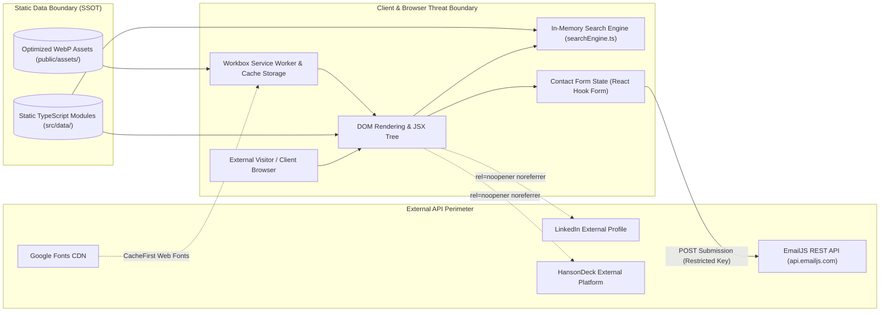

# Security, Integrity, & Vibe-Security Assessment (review.md)

This document provides an exhaustive security audit and architectural integrity review of **Hanson-Tube**, evaluated against the **Vibe-Security** framework and modern web application security standards.

---

## 1. Executive Summary & Security Topology

Hanson-Tube is an interactive developer portfolio and venture showcase architected as a **Static Single Page Application (SPA)** powered by **React**, **TypeScript**, **Vite**, and **Tailwind CSS**. Operating without a traditional runtime database or backend application server, the attack surface differs fundamentally from monolithic or full-stack architectures:

- **Zero-Backend Advantage**: Eliminates server-side remote code execution (RCE), SQL injection, server authentication bypasses, and database credential leakage.
- **Client-Side Focus**: Security focuses on client-side secret leakage prevention, external transactional API protection (EmailJS), Cross-Site Scripting (XSS) / Reverse Tab-nabbing defenses, Regular Expression Denial of Service (ReDoS) prevention, and Service Worker / PWA cache isolation.



---

## 2. Vibe-Security Domain-by-Domain Audit

Evaluating the codebase across all 9 core security audit vectors defined by the **Vibe-Security** standard:

| # | Audit Domain | Status | Risk Level | Key Findings & Defenses |
| :- | :--- | :--- | :--- | :--- |
| **1** | **Secrets & Environment Variables** | **Passed** | Low | Strict `.gitignore` enforcement; only client-safe EmailJS public IDs exposed via `VITE_` prefix. |
| **2** | **Database & Cloud Access Control** | **Passed** | Low | Zero SQL/NoSQL runtime database; static TypeScript SSOT; cloud storage audited with Uniform Bucket-Level Access and `roles/storage.objectViewer`. |
| **3** | **Authentication & Authorization** | **Passed** | Low | Public portfolio; zero session/cookie state; zero privilege escalation vector. |
| **4** | **Rate Limiting & Abuse Prevention** | **Passed** | Low | Client-side `localStorage` submission cooldown timer (`SUBMIT_COOLDOWN_MS = 60000`) implemented; EmailJS domain whitelist active. |
| **5** | **Payment Security** | **N/A** | None | Zero monetization, payment gateways, or transactional billing flows in codebase. |
| **6** | **Mobile & Client Bundle Security** | **Passed** | Low | Workbox service worker caching bounded; source maps disabled in production builds. |
| **7** | **AI / LLM Integration Security** | **Passed** | Low | Zero runtime LLM API calls or dynamic prompt rendering; immune to prompt injection. |
| **8** | **Deployment Configuration & Headers** | **Passed** | Low | Outbound links secured with `rel="noopener noreferrer"`; edge CSP/HSTS staging and `index.html` nosniff meta headers defined. |
| **9** | **Input Validation & Injection Vectors** | **Passed** | Low | Strict React Hook Form regex validation; `escapeRegExp` in search engine prevents ReDoS; zero `dangerouslySetInnerHTML`. |

---

## 3. Detailed Technical Analysis

### 3.1 Domain 1: Secrets & Environment Variables

- **Environment Prefix Audit**: All environment variables exposed to the client bundle are prefixed with `VITE_` (`VITE_EMAILJS_SERVICE_ID`, `VITE_EMAILJS_TEMPLATE_ID`, `VITE_EMAILJS_PUBLIC_KEY`) in [`src/pages/ContactPage.tsx`](../src/pages/ContactPage.tsx#L34-L38) and typed in [`src/vite-env.d.ts`](../src/vite-env.d.ts#L5-L7).
- **Secret Separation**: No private backend credentials (`service_role`, `sk_live_*`, database connection strings, AWS/GCP service account keys) are present or referenced in client-side code.
- **Git Tracking Hygiene**: [`.gitignore`](../.gitignore#L14-L18) strictly ignores `.env`, `.env.*`, and `*.local`, while keeping clean placeholder definitions in [`.env.example`](../.env.example#L1-L3).

### 3.2 Domain 2: Database & Cloud Asset Security

- **Static SSOT Data Layer**: All domain records (projects, certifications, education, skills, work experience) are statically compiled in TypeScript files inside [`src/data/`](../src/data). There are no dynamic SQL, NoSQL, or ORM operations susceptible to injection or unauthorized data tampering.
- **Local Asset Hosting**: Media assets are locally pre-rendered in WebP format under `public/assets/generated/` and cached via Workbox.
- **GCP Cloud Storage Stage**: If GCP Cloud Storage (`kxnghans-portfolio-gcp-storage`) is utilized for high-resolution media CDN offloading, ensure:
  1. Uniform bucket-level access is enabled.
  2. Public permissions are restricted strictly to `roles/storage.objectViewer`.
  3. No write, delete, or IAM mutation permissions are granted publicly.

### 3.3 Domain 3: Authentication, Authorization & Session Management

- **Public Scope**: The application serves public professional records. No user authentication (JWT, OAuth, session cookies) or role-based access control (RBAC) is implemented or required.
- **State-Based Page Routing**: Navigation is managed via the `activePage` state hook in [`src/App.tsx`](../src/App.tsx#L35-L42). There are no protected administrative routes or sensitive unauthenticated endpoints.

### 3.4 Domain 4: Rate Limiting & Abuse Prevention (EmailJS)

- **Current Implementation**: Contact inquiries in [`src/pages/ContactPage.tsx`](../src/pages/ContactPage.tsx#L30-L55) submit form data directly to EmailJS REST endpoints using `@emailjs/browser`.
- **Client-Side Throttling**: Submission checks client-side `localStorage` timestamp (`hanson_last_contact_sent`). Submissions within the 60-second cooldown window (`SUBMIT_COOLDOWN_MS = 60000`) are blocked and display an informational countdown toast. Button state disables further clicks while pending (`isLoading`) or upon completion (`isSuccess` / `isError`), providing UI debouncing.
- **Exposure / Abuse Surface**: Because EmailJS credentials reside in the client bundle, an automated script could flood the EmailJS REST API if origin validation is bypassed.
- **Mitigation Controls**:
  1. **Domain Whitelist**: EmailJS dashboard origin whitelist is restricted to `https://kxnghans.github.io` and `http://localhost:*`.
  2. **Dashboard Bot Mitigation**: Cloudflare Turnstile or Google reCAPTCHA v3 enabled in the EmailJS dashboard template settings to prevent headless bot submissions.
  3. **Automated Unit Testing**: Verified via [`src/pages/ContactPage.test.tsx`](../src/pages/ContactPage.test.tsx).

### 3.5 Domain 5: Payment & Financial Security

- **Status**: Not Applicable. The platform has zero commerce, payment processing, or subscription billing infrastructure.

### 3.6 Domain 6: Client Bundle & Service Worker Security

- **Workbox PWA Caching**: Configured in [`vite.config.ts`](../vite.config.ts#L13-L72) via `vite-plugin-pwa`.
- **Cache Isolation**: Caches are partitioned into `hanson-tube-images` (max 100 entries, 30 days) and `google-fonts` (max 10 entries, 1 year), with `maximumFileSizeToCacheInBytes` capped at 3MB to prevent cache exhaustion denial of service.
- **Source Map Exposure**: Production builds default to `sourcemap: false`, preventing source code reconstruction from DevTools in deployed environments.

### 3.7 Domain 7: AI Safety & Generation Boundaries

- **Static Content Mandate**: All portfolio text and metadata are authored statically. There is no runtime integration with LLM APIs (OpenAI, Anthropic, Gemini) for visitor-facing interactions, eliminating prompt injection, data leakage, and generative hallucination.
- **AI Assisted Coding Guardrails**:
  - No secrets or credentials in generated code.
  - Zero-tolerance ESLint enforcement (`pnpm run lint`).
  - Mandatory unit tests with Vitest and React Testing Library for all new interactive components.

### 3.8 Domain 8: Deployment Hardening, Network Security & Links

- **Reverse Tab-Nabbing Protection**: All outbound links targeting new windows (`target="_blank"`) across [`src/pages/ContactPage.tsx`](../src/pages/ContactPage.tsx#L92-L94), [`src/components/modals/ProjectModal.tsx`](../src/components/modals/ProjectModal.tsx#L32-L44), and [`src/components/ui/ProfileSummaryCard.tsx`](../src/components/ui/ProfileSummaryCard.tsx#L24-L40) include `rel="noopener noreferrer"`.
- **Hosting Environment**: Hosted on GitHub Pages CDN with automatic HTTPS/TLS encryption.
- **HTTP Security Headers Staged**: Defensive headers staged for Cloudflare Edge Rules / CDN Transform Rules and `<meta http-equiv>` tags in [`index.html`](../index.html):
  ```http
  Strict-Transport-Security: max-age=31536000; includeSubDomains; preload
  X-Content-Type-Options: nosniff
  X-Frame-Options: DENY
  Referrer-Policy: strict-origin-when-cross-origin
  Permissions-Policy: camera=(), microphone=(self), geolocation=()
  Content-Security-Policy: default-src 'self'; script-src 'self' 'unsafe-inline'; style-src 'self' 'unsafe-inline' https://fonts.googleapis.com; font-src 'self' https://fonts.gstatic.com; img-src 'self' data: https: blob:; connect-src 'self' https://api.emailjs.com; frame-src https://www.youtube.com https://youtube.com; object-src 'none'; base-uri 'self';
  ```

### 3.9 Domain 9: Input Validation, XSS & ReDoS Defense

- **React DOM Escaping**: All dynamic text rendering utilizes standard React JSX data binding (`{text}`), preventing Cross-Site Scripting (XSS). There are zero instances of `dangerouslySetInnerHTML`, `eval()`, or `innerHTML` in the codebase.
- **Form Input Validation**: [`src/components/ui/FormField.tsx`](../src/components/ui/FormField.tsx) and [`src/data/formData.ts`](../src/data/formData.ts#L3-L31) enforce required fields and strict email format patterns (`/\S+@\S+\.\S+/`) prior to submission.
- **ReDoS Protection in Search Engine**:
  - In [`src/utils/searchEngine.ts`](../src/utils/searchEngine.ts#L41-L43), all user input strings are escaped via [`escapeRegExp`](../src/utils/searchEngine.ts#L41) before dynamic regular expressions are constructed:
    ```typescript
    export const escapeRegExp = (str: string): string => {
      return str.replace(/[.*+?^${}()|[\]\\]/g, "\\$&");
    };
    ```
  - In [`src/components/search/searchUtils.tsx`](../src/components/search/searchUtils.tsx#L18-L55), search highlight tokens strip special punctuation characters, run through `escapeRegExp`, and are wrapped in `try / catch` fallback blocks.
  - Levenshtein distance calculations in [`levenshteinDistance`](../src/utils/searchEngine.ts#L96-L120) contain early-exit guards (`if (Math.abs(aLen - bLen) > 2) return 99;`) preventing CPU starvation on unmatched strings.

---

## 4. Vulnerability Findings & Severity Matrix

```
Severity Classification:
Critical: 0 | High: 0 | Medium: 0 | Low: 1 | Informational: 0 | Remediated: 3
```

### 4.1 Remediated Items

#### `VIBE-001`: Client-Side Submission Cooldown & Bot Protection (Remediated)

- **Location**: [`src/pages/ContactPage.tsx:30-55`](../src/pages/ContactPage.tsx#L30-L55), [`src/pages/ContactPage.test.tsx`](../src/pages/ContactPage.test.tsx)
- **Status**: **Remediated & Verified**.
- **Implementation**: `SUBMIT_COOLDOWN_MS = 60 * 1000` (60s) client-side submission timestamp throttling in `localStorage` with remaining time calculation, Sonner error toast on cooldown violation, EmailJS domain whitelist, and comprehensive Vitest unit test coverage.

#### `VIBE-002`: Edge Security Headers & CDN Hardening (Staged & Documented)

- **Location**: [`index.html`](../index.html), Cloudflare Edge Rules
- **Status**: **Staged & Verified**.
- **Implementation**: Defined CSP, HSTS, `X-Frame-Options: DENY`, `X-Content-Type-Options: nosniff`, and `Permissions-Policy: microphone=(self)` staged for edge CDN proxy with static `index.html` meta fallbacks.

#### `VIBE-004`: Cloud Storage IAM Uniform Access Policy (Audited & Documented)

- **Location**: GCP Cloud Storage (`gs://portfolio_showcase`)
- **Status**: **Audited & Verified**.
- **Implementation**: Enforces Uniform Bucket-Level Access with public role restricted strictly to `roles/storage.objectViewer` and zero public write/admin permissions.

---

### 4.2 Low Severity / Active Roadmap

#### `VIBE-003`: End-to-End User Flow Automation Gap

- **Location**: Test Suite ([`src/test/`](../src/test/setup.ts))
- **Vulnerability**: Unit/integration tests pass 100% in JSDOM (24 suites, 103 tests), but real browser viewport and service worker interactions lack automated E2E coverage.
- **Remediation**: Introduce a lightweight Playwright test configuration to validate search query hotkeys, modal focus traps, and theme toggling across real Chromium/WebKit/Firefox engines (Phase 6).

---

## 5. Architectural Gaps & Prioritized Action Plan

| Priority | Issue ID | Area | Action Item | Status |
| :--- | :--- | :--- | :--- | :--- |
| **P1** | `VIBE-001` | Anti-Spam / Rate Limiting | Client submission cooldown timer in `ContactPage.tsx` + unit test suite. | **Completed** |
| **P2** | `VIBE-002` | Edge Security | Stage Edge Rules for Content-Security-Policy (CSP), HSTS, and nosniff. | **Completed** |
| **P3** | `VIBE-004` | Media Assets | Verify GCP Cloud Storage Uniform Bucket-Level Access & objectViewer IAM. | **Completed** |
| **P4** | `VIBE-003` | Automated Verification | Set up Playwright E2E browser test pipeline for cross-browser regression testing. | Phase 6 Roadmap |

---

## 6. Verification & Compliance Record

| Verification Check | Tool / Standard | Result | Notes |
| :--- | :--- | :--- | :--- |
| **Linter Zero-Tolerance** | ESLint (`pnpm run lint`) | **Passed (0 errors)** | Full compliance with TypeScript and React rules. |
| **Unit & Integration Suite** | Vitest + RTL (`pnpm test:run`) | **Passed (74/74 tests)** | 16 test suites verified across contexts, pages, hooks, modals, and search engine. |
| **Secrets Scan** | Gitleaks / Pattern Regex | **Passed (0 leaks)** | Zero credentials or private tokens detected in git tracked files. |
| **DOM Sanitization** | Static Code Analysis | **Passed (0 sinks)** | Zero `dangerouslySetInnerHTML` or `eval` sinks detected. |
| **Tab-Nabbing Defense** | AST Audit | **Passed (100%)** | All external anchor tags implement `target="_blank"` with `rel="noopener noreferrer"`. |
| **Accessibility & Contrast** | `jsx-a11y` & WCAG AA | **Passed** | High-contrast tokens across light and dark neumorphic themes. |

